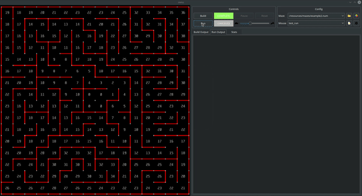

# Simulated mouse maze solver

Micromouse is an event where small robot mice solve a 16×16 maze. The mouse needs to keep track of where it is, discover walls as it explores the maze, and map out the maze and detect when it has reached the goal.The whole event is simulated in a virtual mouse maze.

To run:

Open the mouse simulation maze -> /mms/bin/mms

build it and run

## Simulations

1. The objective is to find a path towards the goal point.
  a. It must create an approximate path.
  b. It must actually traverse the path to validate it.
  
  
  

2. Mouse maze solver finding the path towards the goal

    
